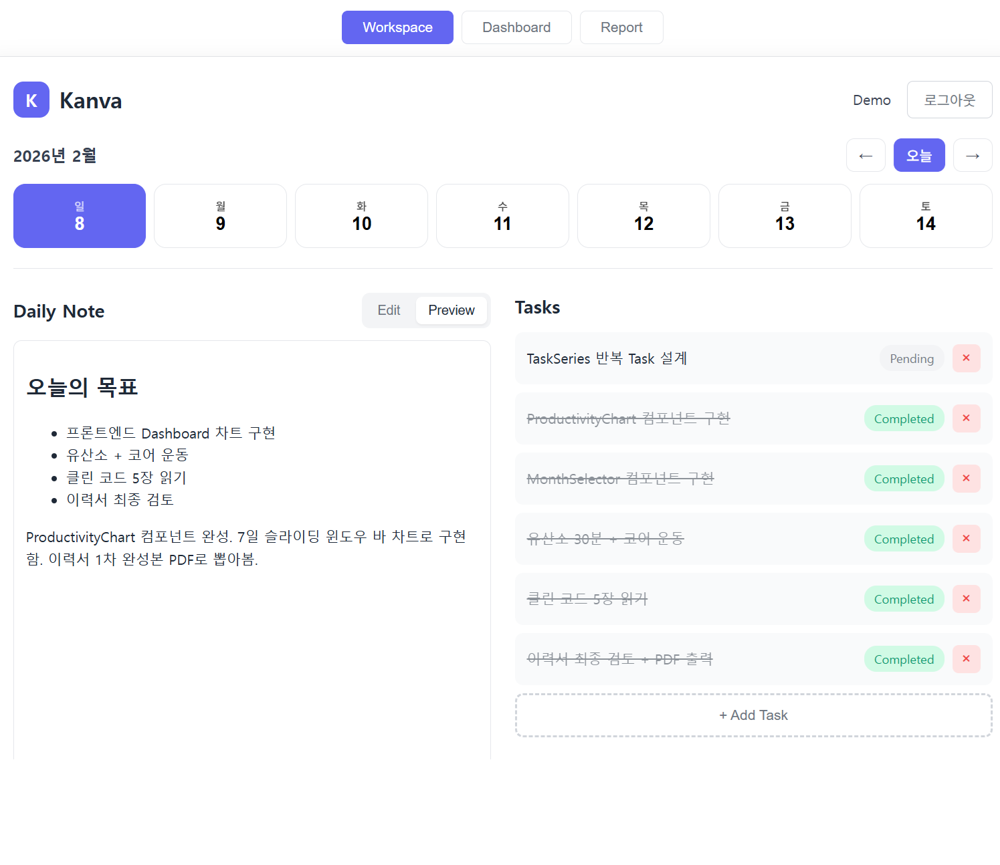
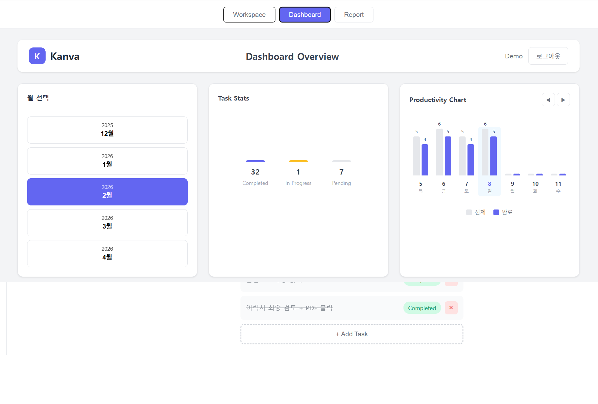
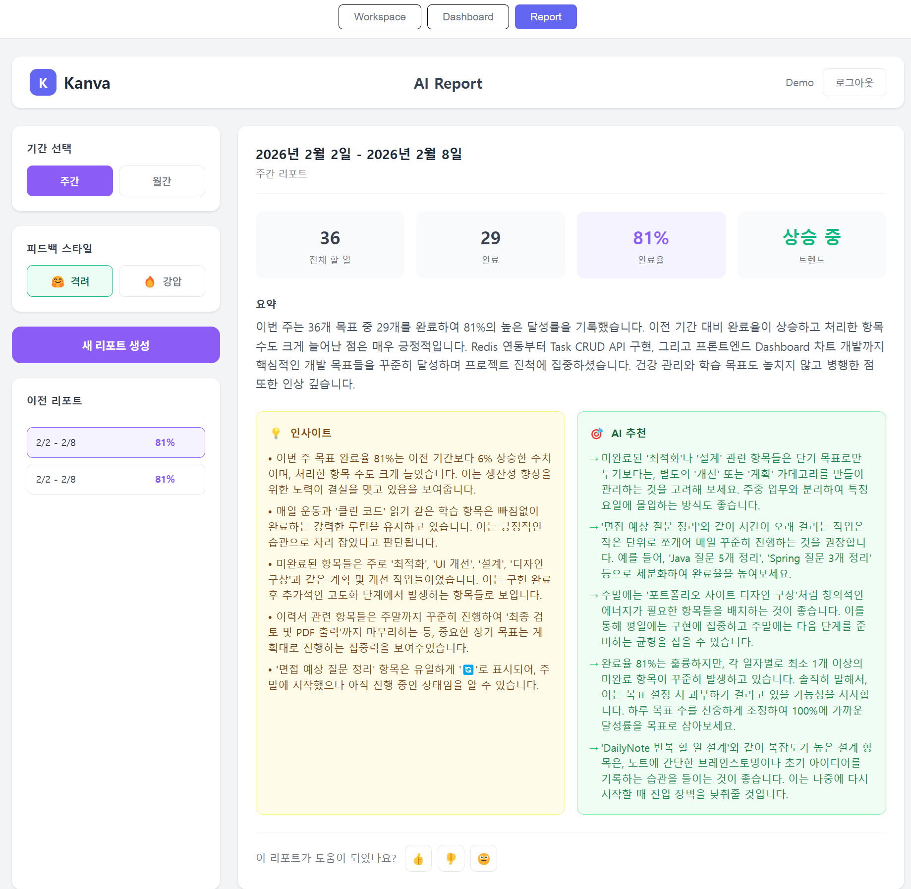
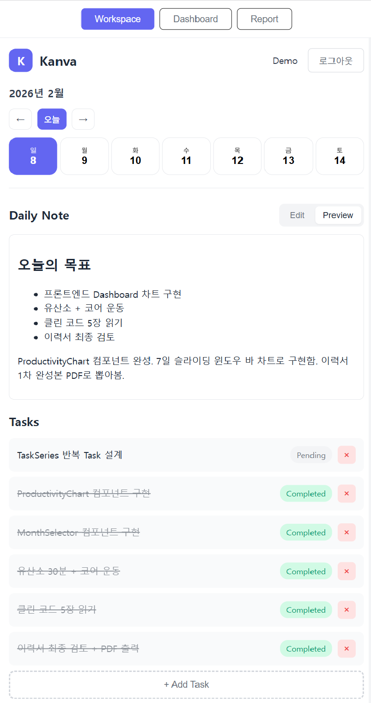
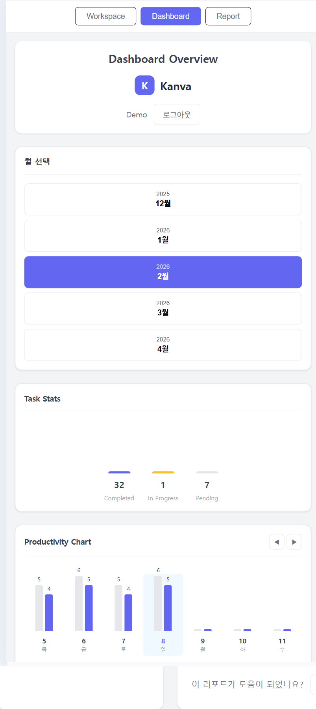
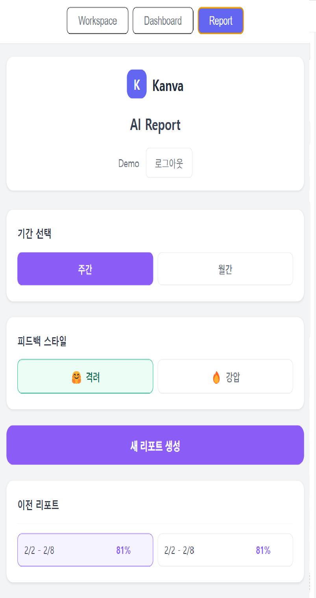
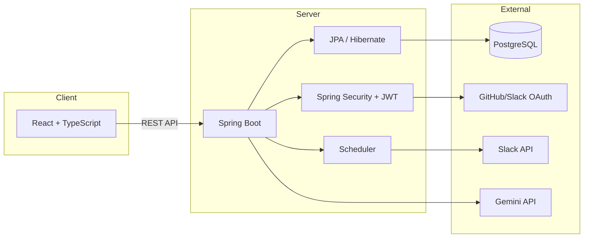

<p align="center">
  
  
  
  
  
  
</p>

<h1 align="center">Kanva</h1>

<p align="center">
  <b>기록하고, 분석하고, 개선하는 업무 관리 서비스</b><br/>
  Daily Note · Task Management · Productivity Dashboard
</p>

<p align="center">
  🌐 <a href="https://kanva.work"><b>https://kanva.work</b></a>
</p>

<p align="center">
  <b>Demo Account</b> — 닉네임: <code>Demo</code> / 비밀번호: <code>1234</code>
</p>

---

## Overview

**Kanva**는 일일 노트와 할 일 관리를 통합하여, 개인의 업무 흐름과 생산성을 분석할 수 있는 서비스입니다.

OAuth 인증, 스케줄링 기반 알림, 대시보드 통계, AI 리포트, AWS 배포까지 포함된 구조를 기획부터 배포까지 직접 설계하고 구현했습니다.

---

## Screenshots

| Workspace | Dashboard | AI Report |
|:---------:|:---------:|:---------:|
|  |  |  |

<details>
<summary>📱 Mobile</summary>

| Workspace | Dashboard | AI Report |
|:---------:|:---------:|:---------:|
|  |  |  |

</details>

---

## Background

ERP/MES 도메인에서 C#으로 쌓아온 백엔드 경험을 Java/Spring 생태계로 확장하기 위해 시작한 프로젝트입니다.

SNS 클론, Board API 등 학습 프로젝트를 거치며 Spring Boot/JPA의 기본기를 다진 뒤, 인증·스케줄링·외부 API 연동·인프라 구성까지 직접 경험하는 것을 목표로 Kanva를 진행하고 있습니다.

백엔드 전반의 구조 설계와 인프라 구성은 직접 담당했으며, 프론트엔드는 AI 코딩 도구를 활용하여 기본 UI를 생성한 뒤, 백엔드 API에 맞게 수정·연동했습니다.

---

## Key Features

| Feature | Description | Status |
|---------|-------------|--------|
| Daily Note | 날짜별 마크다운 노트 관리 | ✅ |
| Task Management | 할 일 CRUD 및 상태 관리 | ✅ |
| Repeating Tasks | 반복 Task 자동 생성 | ✅ |
| Slack Notifications | 아침/저녁 리마인더 | ✅ |
| Dashboard | 월별/일별 생산성 통계 | ✅ |
| AI Weekly Report | Gemini 기반 주간 생산성 분석 리포트 | ✅ |
| OAuth Login | GitHub / Slack 로그인 | ✅ |
| Nickname Login | 닉네임 + 비밀번호 로그인 (OAuth 병행) | ✅ |

---

## Architecture



---

## Tech Stack

| Layer | Technologies |
|-------|-------------|
| **Backend** | Java 21, Spring Boot 3.5, Spring Security + JWT, JPA / Hibernate |
| **Frontend** | React 19, TypeScript, Vite |
| **Database** | PostgreSQL 17 |
| **Infrastructure** | AWS EC2, AWS RDS, Nginx, Let's Encrypt |

---

## Key Implementations

### 1. Repeating Task System

반복되는 할 일을 효율적으로 관리하기 위해 TaskSeries 기반 구조를 설계했습니다.

- 조회 시점에 자동 생성 (On-demand) — 불필요한 데이터 생성 방지
- 완료 정책을 분리하여 반복/단건 Task를 독립적으로 관리

### 2. Dashboard Query Optimization

월별 통계 조회 시 N+1 문제를 방지하기 위해 단일 쿼리 기반으로 조회하도록 구조를 개선했습니다.

### 3. OAuth Multi-Provider Connection

GitHub과 Slack 계정을 동시에 연결할 수 있도록 Provider별 Adapter 패턴을 적용했습니다. Slack 연동 정보는 스케줄러 기반 알림(아침 할 일 안내, 저녁 미완료 리마인더)에 활용됩니다.

### 4. AI Weekly Report

Gemini 2.5 Flash를 활용한 주간 생산성 분석 리포트 기능입니다.

- 완료율·트렌드를 계산한 뒤 Gemini API에 프롬프트로 전달하여 자연어 피드백 생성
- 톤 선택 (친근한 코칭 / 엄격한 진단) 및 이전 기간 대비 트렌드 비교
- 사용자 피드백(👍/👎) 수집으로 리포트 품질 추적

### 5. Nickname + Password Login

OAuth 외에 닉네임 기반 로그인을 추가하여 간편한 접근을 지원합니다.

- OAuth(GitHub/Slack)와 병행 운영, 회원가입 시 자동 로그인(JWT 즉시 발급)
- 닉네임을 JWT Subject로 사용, OAuth 사용자는 email 기반으로 호환 유지

---

## API Endpoints (Main)

| Method | Endpoint | Description |
|--------|----------|-------------|
| POST | /api/auth/signup | 회원가입 (닉네임) |
| POST | /api/auth/login | 로그인 (닉네임) |
| POST | /api/auth/oauth/{provider}/callback | OAuth 로그인 |
| GET | /api/tasks?date= | 날짜별 Task 조회 |
| POST | /api/tasks?date= | Task 생성 |
| PATCH | /api/tasks/{id}/toggle | 완료 토글 |
| DELETE | /api/tasks/{id} | Task 삭제 |
| GET | /api/daily-notes/{date} | 노트 조회 |
| PUT | /api/daily-notes/{date} | 노트 수정 |
| GET | /api/dashboard?month= | 월별 대시보드 조회 |
| POST | /api/reports | AI 리포트 생성 |
| GET | /api/reports | 리포트 히스토리 조회 |
| GET | /api/reports/{id} | 리포트 상세 조회 |
| DELETE | /api/reports/{id} | 리포트 삭제 |
| POST | /api/reports/{id}/feedback | 리포트 피드백 |

---

## Project Structure

```
kanva/
├── backend/src/main/java/com/kanva/
│   ├── auth/oauth/provider/    # OAuth Provider Adapter 패턴
│   ├── common/                 # ApiResponse, ErrorCode
│   ├── config/                 # Security, Clock, JPA Config
│   ├── controller/             # REST Controllers
│   │   └── report/             # AI Report Controller
│   ├── domain/                 # Entities + Repositories
│   │   └── report/             # AIReport, ReportStatus, ReportFeedback
│   ├── dto/                    # Request/Response DTOs
│   ├── exception/              # Global Exception Handler
│   ├── scheduler/              # TaskSeries, Notification Schedulers
│   ├── security/               # JWT Provider, Filter
│   └── service/
│       ├── impl/               # Service 구현체
│       └── report/             # AIAnalysisService (확장 가능 구조)
│
└── frontend/src/
    ├── components/
    │   ├── dashboard/          # TaskStats, ProductivityChart
    │   └── report/             # ReportHistoryList, InsightCard, RecommendationCard, FeedbackButton
    ├── contexts/               # AuthContext (OAuth 상태 관리)
    ├── pages/                  # Workspace, Dashboard, AIReportPage
    ├── services/               # API Client (fetchWithAuth)
    └── types/                  # TypeScript 타입 정의
```
