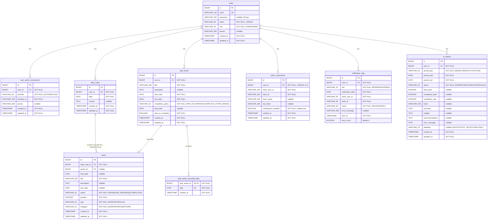

# Kanva ERD

```mermaid
erDiagram
    users {
        BIGINT id PK
        VARCHAR_100 email UK
        VARCHAR_255 password "nullable, BCrypt"
        VARCHAR_50 name "NOT NULL, UNIQUE"
        VARCHAR_20 role "NOT NULL (USER/ADMIN)"
        VARCHAR_500 picture "nullable"
        TIMESTAMP created_at "NOT NULL"
        TIMESTAMP updated_at "NOT NULL"
    }

    user_oauth_connections {
        BIGINT id PK
        BIGINT user_id FK "NOT NULL"
        VARCHAR_20 provider "NOT NULL (GITHUB/SLACK)"
        VARCHAR_100 provider_id "NOT NULL"
        VARCHAR_500 picture "nullable"
        TIMESTAMP created_at "NOT NULL"
        TIMESTAMP updated_at "NOT NULL"
    }

    daily_notes {
        BIGINT id PK
        BIGINT user_id FK "NOT NULL"
        DATE date "NOT NULL"
        TEXT content "nullable"
        TIMESTAMP created_at "NOT NULL"
        TIMESTAMP updated_at "NOT NULL"
    }

    tasks {
        BIGINT id PK
        BIGINT daily_note_id FK "NOT NULL"
        BIGINT series_id FK "nullable"
        DATE task_date "nullable"
        VARCHAR_200 title "NOT NULL"
        TEXT description "nullable"
        DATE due_date "nullable"
        VARCHAR_20 status "NOT NULL (PENDING/IN_PROGRESS/COMPLETED)"
        INTEGER position "NOT NULL"
        VARCHAR_20 type "NOT NULL (WORK/SCHEDULE)"
        VARCHAR_10 category "NOT NULL (WORK/EXERCISE/OTHER)"
        TIMESTAMP created_at "NOT NULL"
        TIMESTAMP updated_at "NOT NULL"
    }

    task_series {
        BIGINT id PK
        BIGINT user_id FK "NOT NULL"
        VARCHAR_200 title "NOT NULL"
        TEXT description "nullable"
        DATE start_date "NOT NULL"
        DATE end_date "NOT NULL"
        VARCHAR_30 completion_policy "NOT NULL (PER_OCCURRENCE/COMPLETE_STOPS_SERIES)"
        DATE stop_date "nullable"
        BOOLEAN stop_on_complete "NOT NULL"
        TIMESTAMP created_at "NOT NULL"
        TIMESTAMP updated_at "NOT NULL"
    }

    task_series_excluded_date {
        BIGINT task_series_id PK,FK "NOT NULL"
        DATE date PK "NOT NULL"
        TIMESTAMP created_at "NOT NULL"
    }

    slack_connections {
        BIGINT id PK
        BIGINT user_id FK "NOT NULL, UNIQUE (1:1)"
        VARCHAR_255 slack_user_id "NOT NULL"
        VARCHAR_255 team_id "NOT NULL"
        VARCHAR_255 team_name "nullable"
        VARCHAR_500 bot_token "nullable"
        BOOLEAN notifications_enabled "NOT NULL, default true"
        TIMESTAMP created_at "NOT NULL"
        TIMESTAMP updated_at "NOT NULL"
    }

    notification_logs {
        BIGINT id PK
        BIGINT user_id FK "NOT NULL"
        VARCHAR_20 slot "NOT NULL (MORNING/EVENING)"
        DATE notification_date "NOT NULL"
        VARCHAR_50 slack_user_id "NOT NULL"
        VARCHAR_50 team_id "NOT NULL"
        VARCHAR_20 result "NOT NULL (SUCCESS/FAIL)"
        VARCHAR_500 error_message "nullable"
        TIMESTAMP sent_at "NOT NULL"
        INTEGER retry_count "default 0"
    }

    ai_reports {
        BIGINT id PK
        BIGINT user_id FK "NOT NULL"
        VARCHAR_20 period_type "NOT NULL (WEEKLY/MONTHLY/CUSTOM)"
        DATE period_start "NOT NULL"
        DATE period_end "NOT NULL"
        VARCHAR_20 status "NOT NULL (GENERATING/COMPLETED/FAILED)"
        INTEGER total_tasks "nullable"
        INTEGER completed_tasks "nullable"
        INTEGER completion_rate "nullable"
        VARCHAR_255 trend "nullable"
        TEXT summary "nullable"
        TEXT insights "nullable"
        TEXT recommendations "nullable"
        TEXT error_message "nullable"
        VARCHAR_20 feedback "nullable (HELPFUL/NOT_HELPFUL/NEUTRAL)"
        TIMESTAMP created_at "NOT NULL"
        TIMESTAMP updated_at "NOT NULL"
    }

    users ||--o{ user_oauth_connections : "has"
    users ||--o{ daily_notes : "has"
    users ||--o{ task_series : "has"
    users ||--o| slack_connections : "has"
    users ||--o{ notification_logs : "has"
    users ||--o{ ai_reports : "has"
    daily_notes ||--o{ tasks : "contains (cascade ALL, orphanRemoval)"
    task_series ||--o{ tasks : "generates"
    task_series ||--o{ task_series_excluded_date : "excludes"
```
